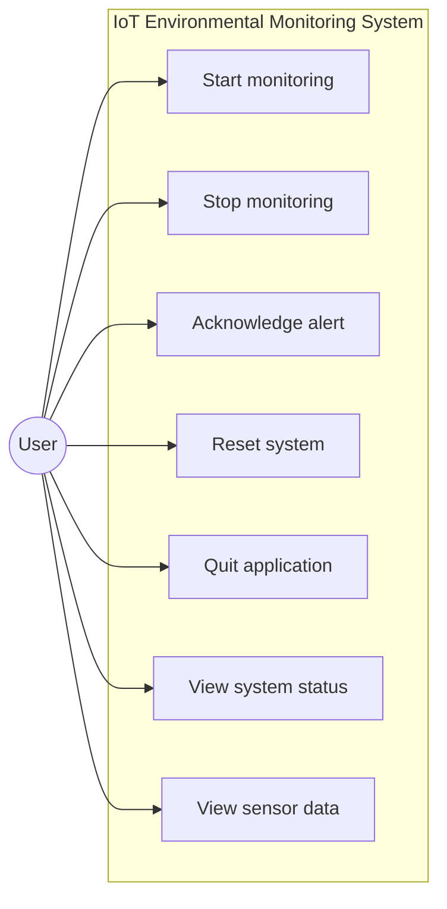
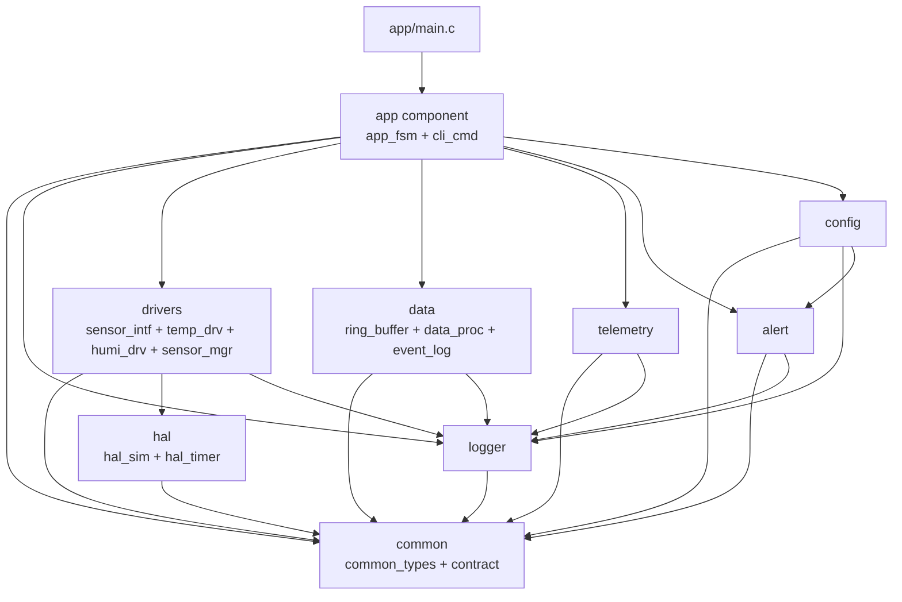
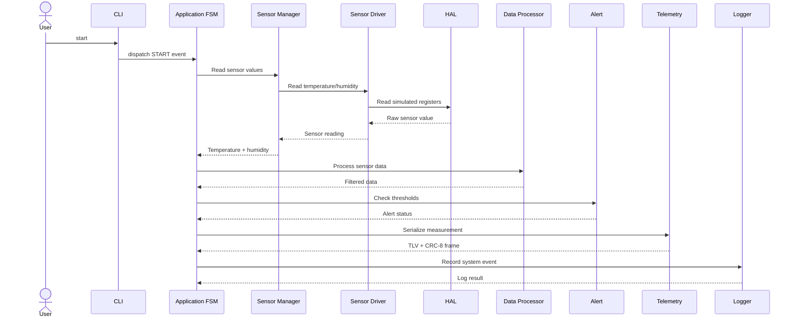
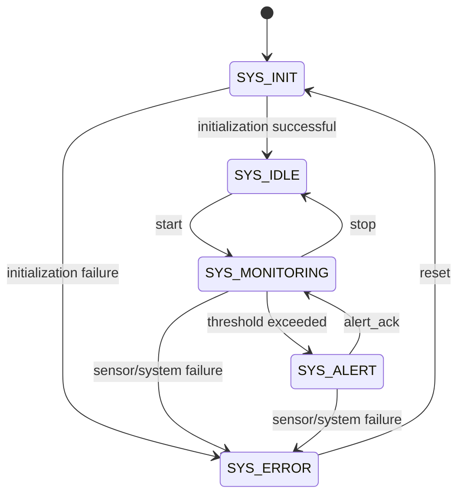
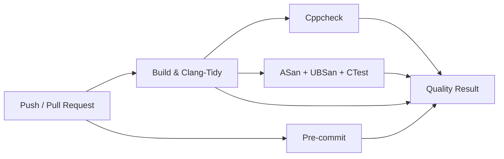

# IoT Environmental Monitoring System — Architecture

## 1. System Overview

The IoT Environmental Monitoring System is a modular C11 application designed to monitor temperature and humidity, process sensor data, detect threshold violations, record events, serialize telemetry data, and provide a command-line interface for system control.

The project follows a layered component architecture. Each component is implemented as an independent CMake target with explicit dependencies. Shared types and contracts are provided by the `common` component, while hardware simulation is isolated in the `hal` component.

The application is designed to demonstrate embedded C and software engineering concepts including:

* Layered architecture
* Hardware Abstraction Layer (HAL)
* Sensor driver abstraction
* Opaque data structures and interface-based programming
* Function-pointer based finite state machine
* Command dispatch
* Ring buffer data structures
* Moving average filtering
* Intrusive event logging
* TLV serialization
* CRC-8 validation
* POSIX file I/O
* Configuration persistence
* Design-by-Contract
* Unit testing with Unity
* Static analysis
* AddressSanitizer and UndefinedBehaviorSanitizer

---

## 2. Architecture Principles

The project follows these principles:

### 2.1 Separation of concerns

Each component has a focused responsibility. Sensor access, data processing, alert handling, telemetry, configuration, logging, and application control are implemented separately.

### 2.2 Layered dependencies

Components are added in dependency order through the top-level `components/CMakeLists.txt`.

The dependency structure is:

```text
common
  ↓
hal
  ↓
logger
  ↓
drivers
  ↓
data
  ↓
telemetry
  ↓
alert
  ↓
config
  ↓
app
```

The actual component dependency graph is determined by the individual CMake targets.

### 2.3 Hardware abstraction

The `hal` component isolates simulated hardware access from higher-level application logic.

### 2.4 Testability

Each major component has dedicated Unity unit tests. Tests are registered with CTest and can also be executed using an ASan + UBSan build.

### 2.5 Quality gates

The project uses:

* `clang-format`
* `clang-tidy`
* `cppcheck`
* GCC warnings with `-Wall -Wextra -pedantic -Werror`
* AddressSanitizer
* UndefinedBehaviorSanitizer
* Unity unit tests
* CTest
* pre-commit

---

# 3. Layered Architecture

The system can be viewed as the following layers:

```text
┌─────────────────────────────────────────────────────────┐
│                    Application Layer                    │
│                 app/main.c + app component              │
│                                                         │
│              FSM + CLI command dispatcher               │
└────────────────────────────┬────────────────────────────┘
                             │
┌────────────────────────────▼────────────────────────────┐
│                  Application Services                   │
│                                                         │
│        alert        config        telemetry             │
└────────────────────────────┬────────────────────────────┘
                             │
┌────────────────────────────▼────────────────────────────┐
│                    Data Processing                      │
│                                                         │
│       ring_buffer     data_proc      event_log          │
└────────────────────────────┬────────────────────────────┘
                             │
┌────────────────────────────▼────────────────────────────┐
│                 Hardware / Drivers                      │
│                                                         │
│       sensor_mgr     temp_drv     humi_drv              │
│                                                         │
│                  sensor_intf                            │
└────────────────────────────┬────────────────────────────┘
                             │
┌────────────────────────────▼────────────────────────────┐
│                Hardware Abstraction                     │
│                                                         │
│       hal_sim                    hal_timer              │
└────────────────────────────┬────────────────────────────┘
                             │
┌────────────────────────────▼────────────────────────────┐
│                    Common Layer                         │
│                                                         │
│       common_types.h          contract.h                │
└─────────────────────────────────────────────────────────┘

Cross-cutting service:
                     logger
```

---

# 4. UML Diagrams

## 4.1 Use Case Diagram

The primary actor is the system user interacting with the command-line interface.



The CLI commands are dispatched by the application command module and are connected to the application FSM and system services.

---

## 4.2 Component Diagram

The project consists of independent CMake components.



The `test` directory provides component-level unit tests and links each test executable only with the component or components required by that test.

---

## 4.3 Sensor Monitoring Sequence Diagram

A normal monitoring cycle begins at the application layer and proceeds through the sensor manager and hardware abstraction layer.



The exact execution path depends on the current FSM state and the event being processed.

---

## 4.4 System State Diagram

The application FSM contains five system states:

* `SYS_INIT`
* `SYS_IDLE`
* `SYS_MONITORING`
* `SYS_ALERT`
* `SYS_ERROR`



The FSM implementation uses function-pointer based state dispatch to associate system states with their corresponding state handlers.

---

# 5. Module Descriptions

## 5.1 Common

### Files

```text
components/common/
├── CMakeLists.txt
└── include/
    ├── common_types.h
    └── contract.h
```

### Responsibilities

The `common` component provides shared system types and Design-by-Contract support used by other components.

### Concepts

* Fixed-width integer types
* Shared enumerations
* Boolean types
* Design-by-Contract
* Common interfaces

### Dependencies

None.

---

## 5.2 HAL

### Files

```text
components/hal/
├── CMakeLists.txt
├── include/
│   ├── hal_sim.h
│   └── hal_timer.h
└── src/
    ├── hal_sim.c
    └── hal_timer.c
```

### Responsibilities

The HAL provides simulated hardware registers and timer functionality.

`hal_sim` provides simulated sensor values, while `hal_timer` provides timer tick functionality.

### Concepts

* Hardware abstraction
* Register access
* Timer simulation
* `volatile`
* Deterministic testing

### Dependencies

* `common`

---

## 5.3 Logger

### Files

```text
components/logger/
├── CMakeLists.txt
├── include/
│   └── logger.h
└── src/
    └── logger.c
```

### Responsibilities

The logger provides application logging with configurable log levels and POSIX file I/O.

### Concepts

* Variadic functions/macros
* Log-level filtering
* POSIX file operations
* Formatted output

### Dependencies

* `common`

---

## 5.4 Drivers

### Files

```text
components/drivers/
├── CMakeLists.txt
├── include/
│   ├── humi_drv.h
│   ├── sensor_intf.h
│   ├── sensor_mgr.h
│   └── temp_drv.h
└── src/
    ├── humi_drv.c
    ├── sensor_mgr.c
    └── temp_drv.c
```

### Responsibilities

The driver layer provides temperature and humidity sensor abstractions and a sensor manager.

The `sensor_intf.h` interface allows sensor implementations to follow a common abstraction.

### Concepts

* Interface-based design in C
* Function pointers
* Opaque structures
* Driver abstraction
* Sensor manager

### Dependencies

* `common`
* `hal`
* `logger`

---

## 5.5 Data

### Files

```text
components/data/
├── CMakeLists.txt
├── include/
│   ├── data_proc.h
│   ├── event_log.h
│   └── ring_buffer.h
└── src/
    ├── data_proc.c
    ├── event_log.c
    └── ring_buffer.c
```

### Responsibilities

The data component handles sensor data processing, ring-buffer storage, moving-average filtering, and event logging.

### Concepts

* Ring buffer
* FIFO data structure
* Moving average
* O(1) data operations
* Intrusive linked list
* Static memory management

### Dependencies

* `common`
* `logger`

---

## 5.6 Telemetry

### Files

```text
components/telemetry/
├── CMakeLists.txt
├── include/
│   └── telemetry.h
└── src/
    └── telemetry.c
```

### Responsibilities

The telemetry component serializes and validates sensor information.

It implements TLV-style serialization and CRC-8 validation.

### Concepts

* Serialization
* TLV encoding
* Big-endian representation
* CRC-8
* Input validation
* Defensive programming

### Dependencies

* `common`
* `logger`

---

## 5.7 Alert

### Files

```text
components/alert/
├── CMakeLists.txt
├── include/
│   └── alert.h
└── src/
    └── alert.c
```

### Responsibilities

The alert component evaluates sensor measurements against configured thresholds and manages alert acknowledgement.

### Concepts

* Threshold detection
* Event handling
* State interaction
* Defensive input checking

### Dependencies

* `common`
* `logger`

---

## 5.8 Config

### Files

```text
components/config/
├── CMakeLists.txt
├── include/
│   └── config.h
└── src/
    └── config.c
```

### Responsibilities

The configuration component loads and stores monitoring configuration using a persistent file.

It also handles malformed configuration lines and out-of-range values.

### Concepts

* POSIX file I/O
* Text parsing
* Configuration persistence
* Input validation
* Safe parsing

### Dependencies

* `common`
* `logger`
* `alert`

---

## 5.9 Application

### Files

```text
components/app/
├── CMakeLists.txt
├── include/
│   ├── app_fsm.h
│   └── cli_cmd.h
└── src/
    ├── app_fsm.c
    └── cli_cmd.c
```

### Responsibilities

The application component implements the system finite state machine and CLI command dispatcher.

The FSM controls system-level transitions while the CLI converts user commands into application events.

### Concepts

* Finite State Machine
* Function-pointer dispatch
* Event-driven design
* Command dispatcher
* State transition validation

### Dependencies

The application component integrates the lower-level components required by the system.

---

## 5.10 Main Application

### Files

```text
app/
├── CMakeLists.txt
└── main.c
```

### Responsibilities

The top-level executable initializes the monitoring system and runs the application loop.

The main application connects the application component and the system services into the final executable.

---

# 6. Testing Architecture

The project contains seven Unity-based test executables.

| Test executable        | Main component tested | Test source              |
| ---------------------- | --------------------- | ------------------------ |
| `test_hal`             | HAL                   | `test_hal_sim.c`         |
| `test_logger`          | Logger                | `test_logger.c`          |
| `test_sensors_drv`     | Drivers               | `test_sensor_drv.c`      |
| `test_data_structures` | Data                  | `test_data_structures.c` |
| `test_telemetry`       | Telemetry             | `test_telemetry.c`       |
| `test_app_logic`       | Application + Alert   | `test_app_logic.c`       |
| `test_config`          | Config                | `test_config.c`          |

CTest is used to discover and execute the test executables.

The project also provides an ASan + UBSan configuration:

```bash
cmake -B build-asan \
    -DSANITIZER=asan+ubsan \
    -DCMAKE_BUILD_TYPE=Debug

cmake --build build-asan
ctest --test-dir build-asan -V
```

---

# 7. Integration Map

| Module       | Main lecture/topic    | Implemented concept                                     |
| ------------ | --------------------- | ------------------------------------------------------- |
| `common`     | C fundamentals        | Fixed-width types, shared interfaces                    |
| `hal`        | Embedded C / HAL      | Hardware abstraction, registers, timer                  |
| `logger`     | Advanced C            | Variadic macros, POSIX I/O                              |
| `drivers`    | Advanced C / OOP in C | Function pointers, sensor interface, opaque abstraction |
| `data`       | Data structures       | Ring buffer, moving average, linked list                |
| `telemetry`  | Serialization         | TLV, CRC-8, byte ordering                               |
| `alert`      | Application logic     | Threshold detection, event handling                     |
| `config`     | File I/O              | Configuration persistence and safe parsing              |
| `app`        | Software architecture | FSM, function-pointer dispatch, CLI                     |
| `test`       | Software testing      | Unity, CTest, unit testing                              |
| Project-wide | Software quality      | CMake, clang-tidy, cppcheck, pre-commit, sanitizers     |

---

# 8. Build and Quality Architecture

The project uses CMake as its build system.

The default build enables strict compiler diagnostics:

```text
-Wall
-Wextra
-pedantic
-Werror
-std=c11
```

Clang-Tidy is automatically enabled when the executable is available.

Cppcheck is exposed as a dedicated CMake target:

```bash
cmake --build build --target cppcheck
```

Pre-commit executes formatting and static-analysis hooks.

Sanitizer testing uses:

```text
AddressSanitizer
UndefinedBehaviorSanitizer
```

The project therefore applies multiple independent quality controls before release.

---

# 9. CI Architecture

GitHub Actions provides four independent quality jobs:



The CI pipeline is defined in:

```text
.github/workflows/ci.yml
```

The pipeline runs for pushes to branches and for pull requests targeting `develop` or `main`.

---

# 10. Project Structure

```text
iot_monitoring_system/
├── app/
│   ├── CMakeLists.txt
│   └── main.c
│
├── components/
│   ├── alert/
│   ├── app/
│   ├── common/
│   ├── config/
│   ├── data/
│   ├── drivers/
│   ├── hal/
│   ├── logger/
│   └── telemetry/
│
├── test/
│   ├── CMakeLists.txt
│   ├── test_app_logic.c
│   ├── test_config.c
│   ├── test_data_structures.c
│   ├── test_hal_sim.c
│   ├── test_logger.c
│   ├── test_sensor_drv.c
│   └── test_telemetry.c
│
├── CMakeLists.txt
├── .clang-tidy
├── .gitignore
└── .pre-commit-config.yaml
```

---

# 11. Release Architecture

The project follows the following Git workflow:

```text
feature/IOT-xxx-*
        │
        ▼
     develop
        │
        ▼
release/v1.0.0
        │
        ▼
       main
        │
        ▼
      v1.0.0
```

All quality gates must pass locally before the release branch is merged into `main`.

The final release is identified by the Git tag:

```text
v1.0.0
```

```
```
